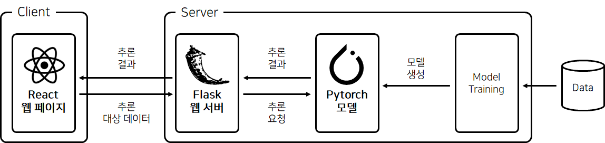
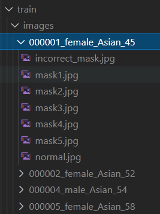

# ai-port-backend

딥러닝 모델에 대해 학습한 내용을 웹사이트로 구현한 웹사이트의 서버 코드입니다. 현재는 계속 개발 중으로, 마스크 착용 여부 인식만 구현되어 있으며 추후 자연어 처리 관련한 기능을 추가할 예정입니다.

## 데모 페이지

[https://www.aiport.kr/](https://www.aiport.kr/)

주의: 마스크 인식 등 서버 접속을 위해서 반드시 https로 접속되어 있는지 확인바랍니다.

## 설명

본 프로젝트에는 모델 학습에서부터 REST API 기반 추론 요청에 응답 가능한 모듈까지 딥러닝 서버에 필요한 파이프라인이 포함되어 있습니다.



### 마스크 인식

상세한 모델 개발 과정은 [https://www.aiport.kr/mask](https://www.aiport.kr/mask)의 내용을 참조해 주세요.

#### 모델 학습

```bash
$ python train.py --target mask_detector --config_file config.yaml
```

- 모델 학습은 train.py를 실행하여 수행할 수 있습니다. 모델 파일은 ./asset/results/checkpoint/(trainee_name)/best.pth로 저장됩니다.

- ./aiport_server/mask_detector/config.yaml에서 학습에 사용되는 하이퍼파라미터들을 추가, 수정, 제거할 수 있습니다.

- 학습에 사용되는 데이터의 파일 구조는 아래 그림과 같습니다. config.yaml에서 데이터 폴더 위치를 지정할 수 있습니다.

    

- 데이터의 경우 저작권 및 용량 관련으로 본 프로젝트에는 포함되어 있지 않습니다.


#### 추론 요청

Flask 서버 실행 후 서버에 'mask/' 라우터로 이미지 파일을 포함하여 POST 요청을 하면 EfficientNet 기반 Pytorch 모델을 통해 마스크 인식여부를 반환받을 수 있습니다.


## 서버 실행 방법

본 프로젝트를 Clone 한 후 프로젝트 폴더에서 아래의 명령어를 실행합니다.

Bash shell
```bash
$ pip install -r requirements.txt
$ export FLASK_APP=aiport_server
$ export FLASK_APP=aiport_server
$ export FLASK_ENV=development
$ flask run
```

Powershell
```powershell
> pip install -r requirements.txt
> $env:FLASK_APP = "aiport_server"
> $env:FLASK_ENV = "development"
> flask run
```

## 참조

- 클라이언트 프로젝트
    - [https://github.com/ysb06/ai-port-frontend](https://github.com/ysb06/ai-port-frontend)